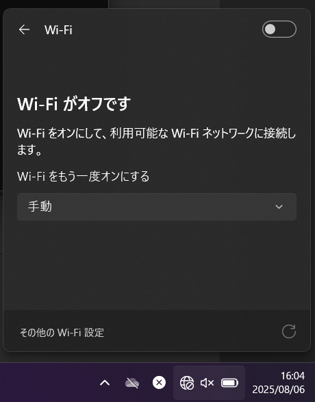
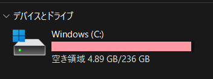
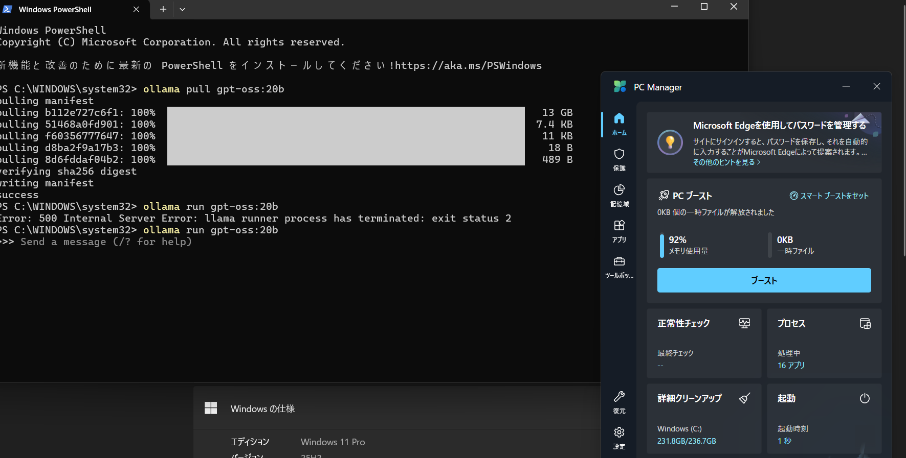
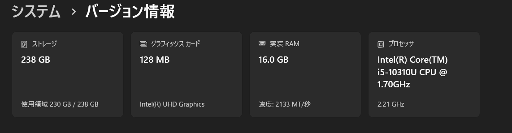

# 🧠 Local 20B LLM Boot — On the Edge of Capacity

This repository documents a rare, high-risk attempt to locally run a **20B parameter language model (gpt-oss:20b)**  
on a mid-spec **Panasonic Let's Note** laptop — fully offline, with almost no free RAM or SSD space.

---
---

## 🎥 Boot Attempt Recording

This short video captures the moment I attempted to run `gpt-oss:20b`  
under extreme conditions:  
- 92% RAM usage  
- Less than 5GB SSD free  
- No Wi-Fi  
- i5 CPU with integrated GPU

<video src="girigiriOSSkido.mp4" controls width="600">
  Your browser does not support the video tag.
</video>

🔗 [Click here to download or view the video directly](./girigiriOSSkido.mp4)

---

## 🧩 The Machine — Panasonic Let's Note CF-SV

| Spec           | Value                          |
|----------------|---------------------------------|
| Model          | **Panasonic Let's Note CF-SV** |
| Processor      | Intel(R) Core(TM) i5-10310U CPU @ 1.70GHz (Turbo: 2.21GHz) |
| RAM            | 16.0 GB (15.7 GB usable)        |
| Graphics       | Integrated Intel UHD (128MB)    |
| Storage        | 236GB SSD (with <5GB free at test time) |
| OS             | Windows 11 Pro                 |
| Wi-Fi Status   | **OFF (Air-gapped)**           |
| Made in        | **🇯🇵 JAPAN**                   |

🛡️ Known for durability, portability, and business-class resilience.  
But today, it proved capable of far more — running a **20B LLM under impossible conditions.**

> "**Not built for this... but still did it.**"

## 🔐 Offline Proof

This was a **true local execution**.  
The system was completely disconnected from the internet at the time of model launch:

### 🔒 No Wi-Fi  


### 💽 SSD Nearly Full  


### 🧠 RAM Near Capacity  


### 🖥 System Specs  


---

## 🚨 Execution Attempt Log

```powershell
ollama run gpt-oss:20b

📜 Why This Matters
In a world where most LLMs depend on the cloud,
this attempt proves that a laptop with modest specs, limited storage, and no network
can still fight to host a massive model like a 20B LLM — locally.

It’s not about winning. It’s about proving it can be tried.
It’s about reminding ourselves:

"You don’t need perfect conditions to try impossible things."

✍️ Notes
Model loading partially succeeded

RAM limit likely triggered runtime crash (exit status 2)

Execution was monitored with no other major processes running

This was done intentionally without freeing space, to prove the threshold

🧠 Authored by
KGNINJA
https://x.com/FuwaCocoOwnerKG

“I chose a machine not because it was strong,
but because it would make the story stronger.”

🏷 Tags
#OfflineLLM #20Bboot #LimitBreak #KGNINJA
